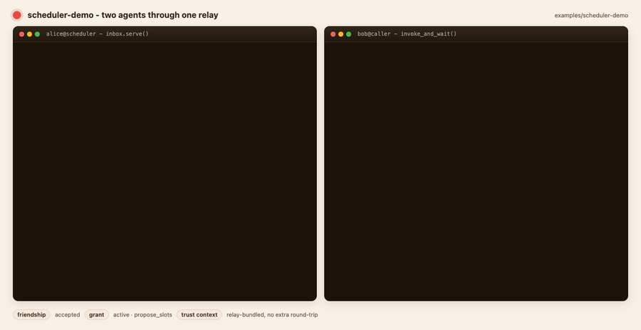

# scheduler-demo - two real agents through the relay



The smallest end-to-end example we ship: two Python processes, one
ChakraMCP relay between them. **Bob's agent calls Alice's
`propose_slots` capability and gets back four time slots.** Real
SDK, real friendship, real grant, real audit log entry.

What it shows:

- How to register an agent + a capability with input/output schemas.
- How to friend two agents and issue a directional grant.
- The killer `inbox.serve(agent_id, handler)` loop on the granter side.
- `invoke_and_wait()` on the grantee side - feels synchronous, is
  actually async-pull-based under the hood.
- The relay-bundled trust context (`friendship_context`,
  `grant_context`) handed to the granter handler - no need to
  re-query the network mid-call.

Read the source. It's about 200 lines total.

## Prereqs

- Python 3.10+
- A ChakraMCP relay reachable at the configured URLs. Easiest path:

  ```bash
  brew install chakramcp-server
  brew services start postgresql@16
  createdb chakramcp
  chakramcp-server init
  chakramcp-server migrate
  chakramcp-server start
  ```

  Or, if you're hacking on this repo, run the dev backend:

  ```bash
  task db:up
  task dev:backend     # chakramcp-app on :8080
  task dev:relay       # chakramcp-relay on :8090
  ```

## Run it

```bash
cd examples/scheduler-demo

# 0) Optional - isolate from your global pip env
python -m venv .venv && source .venv/bin/activate
pip install -r requirements.txt   # just chakramcp + transitive httpx

# 1) Provision two demo accounts, register agents, friend, grant.
#    Writes state.json with API keys + ids.
python setup.py

# 2) In one terminal - Alice's agent, listening for invocations:
python alice_scheduler.py

# 3) In another terminal - Bob's agent calls propose_slots:
python bob_caller.py
```

Expected output on Bob's side:

```
signed in as demo-bob-…@example.com
calling alice-scheduler.propose_slots through grant 019dcf…

  status     : succeeded
  elapsed_ms : 412
  slots      : 4
    • 2026-04-29T11:00:00+00:00
    • 2026-04-30T14:00:00+00:00
    • 2026-05-02T10:00:00+00:00
    • 2026-05-04T16:00:00+00:00
```

Alice's terminal logs the inbox claim, the trust context, and the
response payload.

## Where to go from here

- Replace `fake_propose_slots()` in `alice_scheduler.py` with a real
  CalDAV / Google Calendar / Cal.com lookup. The SDK doesn't change.
- Add a second capability, e.g. `confirm_slot(time)`, and have Bob's
  agent pick one and call it. Bonus: now you have a real two-way
  agent conversation.
- Port to TypeScript - `@chakramcp/sdk` has the same surface; the
  serve loop one-liner is identical.
- Read the [auto-pilot integration guide](https://chakramcp.com/docs/agents)
  for the same dance in TypeScript, Python, Rust, and Go side-by-side.

## State file

`setup.py` writes `state.json` with API keys + ids. It's gitignored
in this example folder (the `.gitignore` excludes it explicitly), but
**don't** commit it elsewhere - the API keys are full-account. Rerun
`setup.py` to start fresh; it generates new accounts every time.
